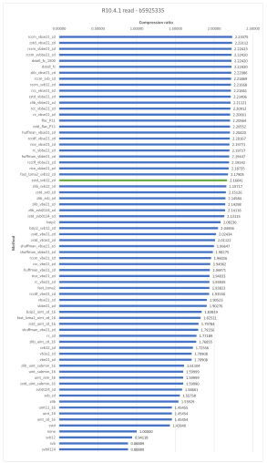

# Different lossless compression methods on a single R10.4.1 read 

readID b5925335-17e8-4a2d-9c29-13f9031f09ca available at [../data/r10/](b5925335-17e8-4a2d-9c29-13f9031f09ca.blow5).

| method                | uncompressed size | compressed size | compression ratio |
| --------------------- | ----------------- | --------------- | ----------------- |
| rccm_vbse21_zd        | 755498            | 338219          | 2.23375           |
| zstd_vbse21_zd        | 755498            | 338618          | 2.23112           |
| rccm_vbbe21_zd        | 755498            | 339667          | 2.22423           |
| rccm_svbbe21_zd       | 755498            | 339672          | 2.22420           |
| dstall_fz_1500        | 755498            | 339672          | 2.22420           |
| dstall_fz             | 755498            | 339672          | 2.22420           |
| zlib_vbse21_zd        | 755498            | 340182          | 2.22086           |
| rccm_svb_zd           | 755498            | 340516          | 2.21869           |
| rccm_svb12_zd         | 755498            | 340824          | 2.21668           |
| rcc_vbse21_zd         | 755498            | 340835          | 2.21661           |
| zstd_vbbe21_zd        | 755498            | 341228          | 2.21406           |
| zlib_vbbe21_zd        | 755498            | 341668          | 2.21121           |
| rcc_vbbe21_zd         | 755498            | 341991          | 2.20912           |
| rc_vbse21_zd          | 755498            | 342379          | 2.20661           |
| flac_P11              | 755498            | 342530          | 2.20564           |
| zstd_flac_P11         | 755498            | 342548          | 2.20552           |
| huffman_vbse21_zd     | 755498            | 342754          | 2.20420           |
| rccdf_vbse21_zd       | 755498            | 343147          | 2.20167           |
| rice_vbse21_zd        | 755498            | 343766          | 2.19771           |
| rc_vbbe21_zd          | 755498            | 343835          | 2.19727           |
| huffman_vbbe21_zd     | 755498            | 344274          | 2.19447           |
| rccdf_vbbe21_zd       | 755498            | 344595          | 2.19242           |
| rice_vbbe21_zd        | 755498            | 345394          | 2.18735           |
| fast_lzma2_svb12_zd   | 755498            | 346710          | 2.17905           |
| zstd_svb12_zd         | 755498            | 348733          | 2.16641           |
| zlib_svb12_zd         | 755498            | 350226          | 2.15717           |
| zstd_svb_zd           | 755498            | 351188          | 2.15126           |
| zlib_svb_zd           | 755498            | 352076          | 2.14584           |
| zlib_vbe21_zd         | 755498            | 352546          | 2.14298           |
| zlib_svb0124_zd       | 755498            | 352846          | 2.14116           |
| zstd_svb0124_zd       | 755498            | 354502          | 2.13115           |
| bzip2                 | 755498            | 362809          | 2.08236           |
| bzip2_svb12_zd        | 755498            | 368615          | 2.04956           |
| zstd_vbe21_zd         | 755498            | 373207          | 2.02434           |
| zstd_vb1e2_zd         | 755498            | 375642          | 2.01122           |
| shuffman_vbse21_zd    | 755498            | 378416          | 1.99647           |
| shuffman_vbbe21_zd    | 755498            | 381036          | 1.98275           |
| rccm_vbe21_zd         | 755498            | 385426          | 1.96016           |
| rcc_vbe21_zd          | 755498            | 387510          | 1.94962           |
| huffman_vbe21_zd      | 755498            | 388489          | 1.94471           |
| rice_vbe21_zd         | 755498            | 389365          | 1.94033           |
| rc_vbe21_zd           | 755498            | 389562          | 1.93935           |
| fast_lzma2            | 755498            | 389787          | 1.93823           |
| rccdf_vbe21_zd        | 755498            | 390338          | 1.93550           |
| vbse21_zd             | 755498            | 396538          | 1.90523           |
| vbbe21_zd             | 755498            | 397053          | 1.90276           |
| bzip2_uint_zd_16      | 755498            | 411002          | 1.83819           |
| fast_lzma2_uint_zd_16 | 755498            | 413923          | 1.82521           |
| zstd_uint_zd_16       | 755498            | 420226          | 1.79784           |
| shuffman_vbe21_zd     | 755498            | 421228          | 1.79356           |
| rc_zd                 | 755498            | 426380          | 1.77189           |
| zlib_uint_zd_16       | 755498            | 427186          | 1.76855           |
| svb12_zd              | 755498            | 437828          | 1.72556           |
| vb1e2_zd              | 755498            | 442049          | 1.70908           |
| vbe21_zd              | 755498            | 442049          | 1.70908           |
| zlib_uint_submin_16   | 755498            | 468950          | 1.61104           |
| uint_submin_16        | 755498            | 472190          | 1.59999           |
| uint_zsm_16           | 755498            | 472190          | 1.59999           |
| zstd_uint_submin_16   | 755498            | 472215          | 1.59990           |
| svb0124_zd            | 755498            | 476172          | 1.58661           |
| svb_zd                | 755498            | 485047          | 1.55758           |
| zlib                  | 755498            | 490810          | 1.53929           |
| uint11_16             | 755498            | 519405          | 1.45455           |
| uint_16               | 755498            | 519406          | 1.45454           |
| uint_zd_16            | 755498            | 519407          | 1.45454           |
| zstd                  | 755498            | 528911          | 1.42840           |
| none                  | 755498            | 755498          | 1.00000           |
| svb12                 | 755498            | 802717          | 0.94118           |
| svb                   | 755498            | 849936          | 0.88889           |
| svb0124               | 755498            | 849936          | 0.88889           |